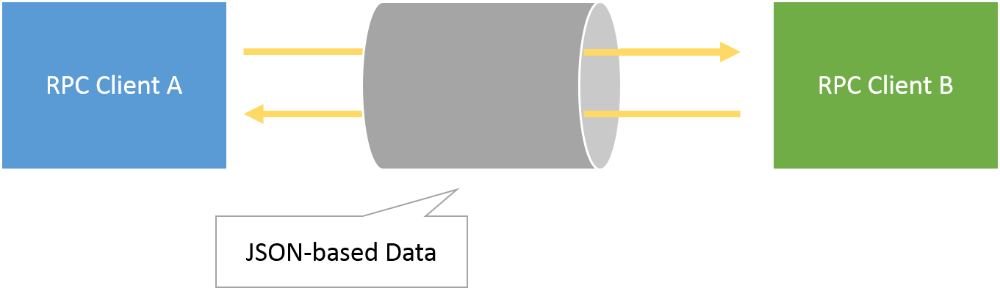

Lestia
------
[](http://badge.fury.io/js/lestia)
[](https://travis-ci.org/pine613/lestia)
[](https://coveralls.io/r/pine613/lestia)
[](https://david-dm.org/pine613/lestia)
[](https://david-dm.org/pine613/lestia#info=devDependencies)

Lestia is a library of Message-based RPC that can do callback.

## What's this ?
Lestia is a library of Message-based RPC. It use JSON as function arguments serialized. It can pass function and can do callback!!




## Get started

```
$ npm install lestia --save
```

## Tests
There are some tests written by [Mocha](http://mochajs.org), [Chai](http://chaijs.com) and [Sinon.JS](http://sinonjs.org).

```
$ npm install
$ npm test
```

## References
### Create new RPC client

```js
var lestia = require('lestia');
var client = lestia();

```

### Set message handler

```js
client.on('send', function (msg) {
  // Send message code
  SomeMessageAPI.send(msg);
});

// Receive message code
SomeMessageAPI.addListener('receive', function (msg) {
  client.emit('receive', msg);
});

```

### Get RPC function

```js
var func = client.get('function_name');
func('arg1', [ 1, 2, 3 ]);
```

### Set RPC function

```js
client.set('function_name', function (arg1, arg2) {
  // Called by remote
});

```

### Log and Error message handling

```js
client.on('error', function (err) {
  console.error(err);
});

client.on('log', function (log) {
  console.log(log);
});
```

## License
MIT License